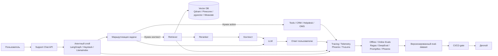
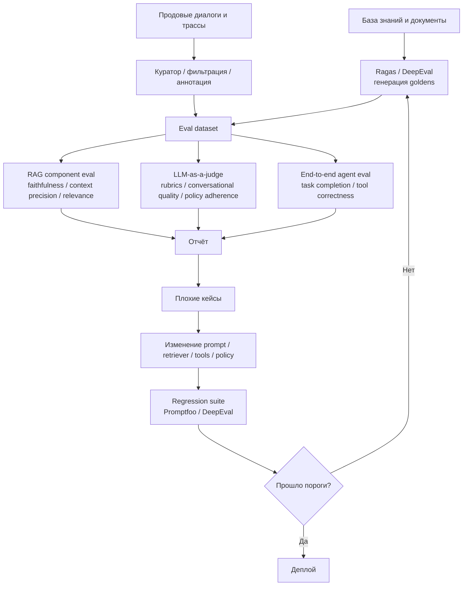

# Аналитический отчёт по выбору библиотек и фреймворков для support-чата ИИ-агента

## Executive summary

Для support-чата ИИ-агента с LLM + RAG и полноценным контуром train/eval рынок сегодня удобно раскладывается на четыре слоя: оркестрация и агентность, data-centric RAG, автоматическая генерация сценариев и датасетов, а также оценка качества на уровне RAG, ответа LLM и end-to-end поведения агента. Для сложных stateful-агентов и многошаговых сценариев особенно сильна связка **LangGraph / LangChain**; для data-centric RAG и быстрых document-centric прототипов — **LlamaIndex**; для прозрачных production-пайплайнов с явными ветвлениями и контролем компонентов — **Haystack**. Для генерации тестовых сценариев и RAG-метрик сегодня особенно выделяется **Ragas**, а для широкого набора LLM-as-a-judge, conversational и agent metrics — **DeepEval**. Для трассировки, анализа трасс и экспериментального цикла поверх реальных agent runs наиболее сильны **Arize Phoenix** и **TruLens**. Для декларативных regression checks и CI/CD-проверок очень практичен **Promptfoo**. citeturn19search12turn23search17turn23search12turn23search6turn24search3turn25search2turn9view2turn17search5turn16search15

Если нужна одна “базовая” рекомендация без излишней фрагментации стека, то для русскоязычного support-чата я бы рекомендовал такой стартовый набор: **LangGraph + LangChain** для оркестрации агента и tool-usage, **Qdrant / pgvector / Pinecone** как векторное хранилище, **Ragas** для генерации одношаговых и многошаговых eval-сценариев из корпоративной базы знаний, **DeepEval** для llm-as-a-judge и conversational / agent evaluation, а **Phoenix** или **Promptfoo** — для регрессий, трассировки и CI/CD-гейтов. Этот стек хорошо покрывает как retrieval-quality, так и answer-quality, multi-turn behavior и tool correctness. citeturn19search12turn22search7turn22search5turn22search10turn18search8turn18search1turn15search17turn15search18turn15search6turn28search3turn16search17

Если же приоритет — не “самый гибкий агент”, а “самый удобный RAG над документами”, то практичнее стартовать с **LlamaIndex + Phoenix + Ragas**: LlamaIndex даёт очень сильную data/query abstraction, question generation и workflows; Phoenix закрывает наблюдаемость, датасеты и эксперименты; Ragas — автоматическую генерацию тестсетов и RAG-метрики. Для строго компонентных production-конвейеров вместо LlamaIndex можно взять **Haystack**, особенно если важны прозрачные branching/looping pipelines и явное управление компонентами. citeturn23search12turn18search10turn17search3turn17search6turn18search8turn24search3turn23search6turn2search11turn2search7

С точки зрения зрелости экосистемы и популярности open-source лидируют **LangChain** и **LlamaIndex** по масштабу GitHub и интеграций; очень быстро растут **LangGraph**, **Promptfoo**, **DeepEval**, **Ragas** и **Phoenix**. При этом важно понимать, что “популярность” и “пригодность для eval” не совпадают: для систематической оценки RAG и многоходовых support-диалогов одной только orchestration-библиотеки недостаточно, нужен отдельный eval-layer. Это согласуется и с современной литературой по multi-turn agent evaluation, где отдельно выделяются task completion, response quality, user experience, memory/context retention и tool integration как разные измерения качества. citeturn22search2turn21view1turn21view0turn9view3turn21view3turn10view5turn10view3turn14search2

## Методика отбора и критерии

В этом обзоре я приоритизировал инструменты, которые одновременно полезны для реального support-чата и закрывают не только “генерацию ответа”, но и инженерный цикл качества: генерацию сценариев, dataset curation, offline eval, llm-as-a-judge, regression testing, trace-level analysis и end-to-end agent testing. В качестве основных критериев использовались: пригодность для RAG, поддержка многошаговых workflow/агентов, наличие автоматической генерации датасетов и сценариев, готовые метрики для retrieval/generation/agent traces, экосистема интеграций с моделями и векторными БД, а также зрелость open-source-проекта по документированности, релизной активности и GitHub-сигналам. citeturn24search3turn25search12turn17search5turn17search3turn16search15turn14search2

Для llm-as-a-judge отдельно важно различать два подхода. Первый — **reference-free / criteria-based judging**, когда LLM оценивает ответ по рубрике без жёсткого эталона; второй — **reference-grounded evaluation**, когда есть ground truth, expected outcome или trace expectations. В современной практике оба режима живут рядом: Ragas исторически вышел из reference-free RAG evaluation, G-Eval стал одной из наиболее влиятельных схем LLM-судьи для произвольных критериев, а production-инструменты вроде DeepEval, Promptfoo и Phoenix добавили поверх этого трассы, CI/CD и многотуровую оценку. citeturn14search0turn14search12turn14search1turn14search17turn20search1turn15search8turn27search8turn28search2

Для support-чата особенно критичны не только faithfulness и answer relevance, но и то, как агент ведёт себя на протяжении нескольких ходов: удерживает ли контекст, умеет ли корректно использовать инструменты, не теряет ли бизнес-правила, не ломается ли при эскалации кейса и корректно ли завершает задачу. Поэтому инструменты ниже отбирались так, чтобы можно было покрыть одновременно single-turn QA, multi-hop retrieval, conversational continuity, tool correctness и end-to-end task completion. citeturn14search2turn15search18turn15search6turn16search4turn17search1

## Ключевые библиотеки и фреймворки

**LangChain + LangGraph** — одна из самых универсальных комбинаций для построения support-агента. LangChain даёт огромную интеграционную поверхность: 1000+ интеграций по chat/embedding models, tools, retrievers, document loaders и vector stores; LangGraph поверх этого даёт низкоуровневую оркестрацию stateful-агентов с durable execution, human-in-the-loop, memory и production-ready deployment. Для support-сценариев особая ценность в том, что можно явно моделировать ветвления, маршрутизацию по типу тикета, эскалацию к человеку и tool-calling к CRM/helpdesk/OMS. В экосистеме есть официальный пример retrieval agent и, отдельно, case study customer support-команды Minimal, где multi-agent архитектура на LangGraph автоматизировала большую часть e-commerce support tickets. Лицензия у обоих репозиториев MIT; зрелость очень высокая: у LangChain около **140k stars** и свежий релиз **18 июня 2026**, у LangGraph около **35.2k stars** и также свежий релиз **18 июня 2026**. Поддержка LLM и vector stores фактически идёт через экосистему LangChain: OpenAI, Anthropic, Google, AWS, NVIDIA, Hugging Face, Ollama и множество других провайдеров; для векторных БД есть единый интерфейс и готовые интеграции с Chroma, Pinecone, Qdrant, Weaviate, Elasticsearch, pgvector и многими другими. Документация, репозитории и кейс customer support доступны в официальных материалах. citeturn22search2turn24search8turn19search12turn11search3turn22search0turn22search1turn22search7turn22search10turn22search11turn22search15turn6view1turn21view0turn26view0

**LlamaIndex** — сильнейший кандидат, если support-чат в первую очередь строится “вокруг данных”, документов, индексирования и retrieval workflows. Фреймворк позиционируется как framework for building LLM-powered agents over your data; поддерживает query engines, retrievers, tools, chatbots и workflows, а также автоматическую генерацию вопросов для evaluation. У LlamaIndex есть Python и TypeScript SDK, а в Python-экосистеме заявлено более **300 integration packages**. Из коробки хорошо работает для knowledge-augmented chatbots, RAG по документам, data agents и query orchestration; это особенно удобно для support-ботов по внутренним знаниям, FAQ, policy docs и product manuals. По LLM-провайдерам официально поддерживаются OpenAI, Anthropic, Google, Hugging Face и многие другие; по vector stores есть официальные модули и примеры для Pinecone, Weaviate, MongoDB Atlas, PGVector, Qdrant и др. Лицензия MIT, зрелость высокая: около **50.2k stars**, последний релиз репозитория — **14 мая 2026**. Практический плюс LlamaIndex — удобство data ingestion и query abstraction; относительный минус — для сложной агентной orchestration многие команды всё равно предпочитают отдельно подключать LangGraph или более явный orchestration layer. citeturn23search12turn12search2turn12search6turn12search10turn18search10turn19search1turn19search9turn12search1turn12search9turn12search0turn12search12turn11search13turn4view1turn21view1turn23search0

**Haystack** — сильная альтернатива для команд, которым нужен production-friendly pipeline framework с явной композицией компонентов. Haystack позиционируется как open-source AI orchestration framework for production-ready LLM applications in Python, с модульными pipelines, loops, branches и agent workflows. Это делает его удобным для support-систем, где нужно не только RAG, но и строгие роутеры, fallback-ветки, отдельные retriever/reranker/generator-компоненты и прозрачная отладка. У Haystack есть evaluation для pipeline и component-level quality, model-based evaluation, а также большая экосистема интеграций с model providers и document stores. По провайдерам репозиторий явно перечисляет OpenAI, Mistral, Anthropic, Cohere, Hugging Face, Azure OpenAI, AWS Bedrock и local models; по хранилищам Haystack интегрируется с несколькими категориями document stores, включая vector DBs, search engines, relational DBs и NoSQL stores, а официальные интеграции доступны, например, для Pinecone. Лицензия Apache 2.0, зрелость высокая: около **25.6k stars**, свежий релиз **18 июня 2026**. Для support-чата Haystack особенно хорош, когда команде нужен не “магический агент”, а контролируемый, обозримый и тестируемый pipeline. citeturn23search6turn4view2turn2search11turn2search7turn2search3turn12search3turn11search2turn11search6turn11search22turn21view2turn12search7turn19search6

**Ragas** — один из самых важных инструментов именно для RAG evaluation и synthetic test generation. Официальная документация описывает его как средство перехода от “vibe checks” к systematic evaluation loops; исторически библиотека выросла из работы **RAGAs: Automated Evaluation of Retrieval Augmented Generation**, где был предложен reference-free evaluation framework для RAG-пайплайнов. На практике Ragas особенно силён в трёх вещах: генерация тестсетов из ваших документов, в том числе на основе knowledge-graph подхода; RAG-метрики вроде faithfulness, answer relevance, context precision/recall и их производные; а также всё более зрелые сценарии multi-turn evaluation. Для генерации сценариев это один из лучших выборов: в документации отдельно разобраны multi-hop query generation и custom multi-hop queries. По моделям Ragas умеет работать напрямую с OpenAI, Anthropic, Google и через LiteLLM — с Azure OpenAI, Bedrock, Vertex AI и сотнями других провайдеров; интегрируется с LangChain, LlamaIndex, Haystack, Arize и другими инструментами. Как eval-layer Ragas не привязан к конкретной vector DB: он работает поверх ваших question-answer-context tuples или framework integrations, так что vector store-поддержка здесь обычно косвенная. Лицензия Apache 2.0, зрелость высокая: около **14.4k stars**, последний релиз на GitHub — **13 января 2026**. Для support-чата это, пожалуй, лучший open-source инструмент именно для создания проверочных сценариев из вашей knowledge base. citeturn24search3turn14search0turn14search12turn0search3turn18search8turn0search10turn18search0turn18search1turn16search18turn24search0turn24search1turn24search6turn10view5

**DeepEval** — наиболее универсальный именно как open-source evaluation framework для LLM apps, RAG, chatbots и agents. Проект строится вокруг идеи “pytest для LLM”: есть datasets/goldens, metrics, end-to-end и component-level evals, tracing, synthetic data generation и conversation simulation. Для ваших требований он закрывает почти весь eval-слой: умеет генерировать single-turn и multi-turn goldens, симулировать полные разговоры через ConversationSimulator, оценивать RAG через answer relevancy / contextual relevancy / faithfulness и др., а агентов — через Task Completion, ToolCorrectnessMetric и ArgumentCorrectnessMetric. Для llm-as-a-judge особенно важны GEval и Conversational G-Eval; при этом framework позволяет использовать не только OpenAI, но и “literally ANY custom LLM”, а через LiteLLM — любой поддерживаемый провайдер. Лицензия Apache 2.0, зрелость высокая и быстро растущая: около **16.3k stars**, GitHub-репозиторий активен, последний релиз — **28 мая 2026**. Для support-чата DeepEval особенно хорош, если нужна единая тестовая рамка для single-turn, multi-turn, tool-calling и regression checks, интегрируемая в CI/CD и локальные тесты. citeturn25search2turn15search3turn15search5turn15search1turn15search17turn15search18turn15search6turn15search9turn20search12turn25search0turn25search7turn25search3turn21view3

**TruLens** — сильный инструмент для оценки и отслеживания LLM experiments и agent traces, особенно если вам важен глубокий feedback analysis и OpenTelemetry-first подход. TruLens продвигает концепцию **RAG Triad**: context relevance, groundedness и answer relevance; помимо этого он даёт stack-agnostic instrumentation и feedback functions для разных частей приложения. В новых версиях OTEL tracing включён по умолчанию, а providers/documentation охватывают OpenAI / Azure OpenAI, LiteLLM, Google, Bedrock, Hugging Face, Ollama и другие OSS/local сценарии. Важная особенность TruLens — хороший баланс между eval и observability: он полезен не только для offline scoring, но и для анализа agent traces, особенно когда вы хотите видеть failure modes по шагам. Vector store support здесь также косвенная: как eval/observability слой он скорее оценивает retrieved context и spans, чем сам управляет хранилищем. Лицензия MIT, зрелость хорошая: около **3.4k stars**, последний релиз — **14 мая 2026**. Для support-чата TruLens особенно полезен, если вам нужен trace-centric quality loop и RAG triad как базовая frame of reference. citeturn17search5turn17search1turn17search2turn17search0turn17search15turn10view1turn10view4

**Arize Phoenix** — один из лучших open-source инструментов для observability + evaluation + experiments над реальными LLM/agent runs. Phoenix описывает себя как platform for experimentation, evaluation and troubleshooting и включает tracing, evaluation, datasets, experiments, playground и prompt management. Для llm-as-a-judge Phoenix и Arize AX поддерживают LLM judges “out of the box”, в том числе span-level и trace-level evaluations across entire agent workflows. Для support-чата это удобно, когда важно не только посчитать score, но и связать его с реальной трассой: какой retriever сработал, что было retrieved, где агент ошибся, на каком ходу был сделан неверный tool call, какой prompt/version ухудшили качество. Из коробки есть интеграции с LangGraph, LlamaIndex, CrewAI, OpenAI Agents SDK, Claude Agent SDK, Vercel AI SDK и др.; по LLM-провайдерам Phoenix позиционируется как vendor-agnostic и перечисляет OpenAI, Anthropic, Google GenAI, Bedrock, OpenRouter, LiteLLM и другие. Лицензия проекта — open-source license в GitHub-репозитории, популярность высокая: около **10.2k stars**, последний релиз — **19 июня 2026**. Если команде нужен сильный observability/experimentation contour вокруг support-агента, Phoenix — один из лучших вариантов. citeturn9view2turn17search3turn17search6turn28search2turn28search3turn28search1turn10view3

**Promptfoo** — очень практичный инструмент для декларативных eval-конфигов, CI/CD и быстрых regression checks над prompts, RAG и agents. Его ключевая сила в том, что проверки описываются в YAML/CLI, легко гоняются локально и в CI, а llm-as-a-judge оформлен очень прагматично через `llm-rubric`, `agent-rubric`, `search-rubric`, `conversation-relevance` и другие assertions. Для support-чата это особенно ценно, когда нужны smoke/regression suites: “ответ релевантен”, “инструмент вызван”, “многотуровый диалог не теряет тему”, “ответ соответствует политике возврата”, “если кейс time-sensitive, включить search-rubric”. Promptfoo также умеет тестировать multi-turn agentic workflows через провайдеры типа OpenAI Agents, поддерживает tracing по OpenTelemetry и CI/CD-интеграции с GitHub Actions, GitLab CI, Jenkins и др. По моделям поддержка широкая: OpenAI, Claude, Gemini и множество других провайдеров и OpenAI-compatible endpoints. Это не RAG framework и не vector-layer, поэтому vector store support косвенная: оценивается конечное приложение, а не хранилище. Лицензия MIT, популярность очень высокая для eval-инструмента: около **22.4k stars**, последний релиз — **16 июня 2026**. Если вам нужен “инженерный” режим тестирования, Promptfoo — один из самых удобных вариантов. citeturn16search15turn16search0turn16search4turn16search17turn16search1turn27search8turn27search13turn27search12turn9view3turn23search19

**OpenEvals** стоит рассматривать как лёгкий дополнительный слой, особенно если вы уже в экосистеме LangChain/LangSmith. Это open-source пакет с готовыми evaluator’ами для LLM apps, включая llm-as-judge, structured output checks и заготовки под agent trajectories. Он заметно менее зрелый и менее “всеядный”, чем DeepEval или Promptfoo, но полезен как простой старт для LangChain-команд. Репозиторий MIT, около **1.1k stars**, последний релиз — **7 апреля 2026**, есть Python и TypeScript-код. Для сложного support-чата я бы рассматривал OpenEvals скорее как дополнение, а не центральный eval-фреймворк. citeturn20search1turn20search3turn4view5

## Сравнительные таблицы

| Инструмент | Основное назначение | Язык | Поддержка LLM | Поддержка векторных БД | Интеграции | Лицензия | GitHub stars | Активность |
|---|---|---|---|---|---|---|---|---|
| LangChain + LangGraph | Orchestration, agents, RAG, tool-usage | Python; JS/TS есть отдельными пакетами | Через LangChain providers: OpenAI, Anthropic, Google, AWS, Hugging Face, Ollama и др. | Через unified vector store interface: Chroma, Pinecone, Qdrant, Weaviate, Elasticsearch, pgvector и мн. др. | Tools, retrievers, embeddings, memory, checkpointers, document loaders | MIT | LangChain **140k**; LangGraph **35.2k** | Оба репозитория с релизами **18 июня 2026** citeturn22search2turn22search0turn22search7turn22search10turn22search11turn22search15turn6view1turn21view0turn23search1 |
| LlamaIndex | Data-centric RAG, query workflows, chatbots, agents | Python и TypeScript | OpenAI, Anthropic, Google, Hugging Face, Mistral, DeepSeek и др. | Vector store modules для Pinecone, Weaviate, MongoDB Atlas, PGVector, Qdrant и др. | Retrievers, query engines, tools, workflows, question generation | MIT | **50.2k** | Последний релиз **14 мая 2026** citeturn23search12turn23search0turn12search1turn12search9turn12search0turn12search12turn11search13turn21view1 |
| Haystack | Production pipelines, explicit RAG, agents, evaluation | Python | OpenAI, Anthropic, Mistral, Cohere, Hugging Face, Azure OpenAI, Bedrock, local | Интеграции по нескольким категориям document stores; в т.ч. vector DBs и search engines | Components, pipelines, loops, branches, tools, evaluation | Apache 2.0 | **25.6k** | Последний релиз **18 июня 2026** citeturn4view2turn11search2turn11search6turn11search22turn21view2turn23search6 |
| Ragas | RAG evaluation, synthetic test generation, multi-hop queries | Python | Direct: OpenAI, Anthropic, Google; через LiteLLM — Azure, Bedrock, Vertex и 100+ providers | Обычно не управляет store напрямую; работает поверх framework integrations и tuples question-answer-context | LangChain, LlamaIndex, Haystack, Arize и др. | Apache 2.0 | **14.4k** | Последний релиз **13 января 2026** citeturn24search0turn24search6turn24search7turn12search11turn10view5 |
| DeepEval | LLM-as-a-judge, RAG eval, conversational eval, agent eval, synthetic data | Python | По умолчанию GPT-family; также Claude, Gemini, Llama, Mistral и любые custom LLM; через LiteLLM — широкая поддержка | Не привязан к store; оценивает outputs, traces и retrieval context | LangChain, LangGraph, OpenAI, CrewAI и др. | Apache 2.0 | **16.3k** | Последний релиз **28 мая 2026** citeturn25search0turn25search7turn25search3turn21view3 |
| TruLens | Eval + observability, RAG Triad, OTEL tracing | Python | OpenAI/Azure, LiteLLM, Google, Bedrock, Hugging Face, Ollama и др. | Не управляет store напрямую; работает поверх traces и retrieved context | OTEL, feedback functions, agent trace analysis, MLflow scorers | MIT | **3.4k** | Последний релиз **14 мая 2026** citeturn17search0turn17search1turn17search2turn17search15turn10view4 |
| Arize Phoenix | Observability, LLM judges, datasets, experiments | Python + TS/JS-компоненты в экосистеме | OpenAI, Anthropic, Google, Bedrock, OpenRouter, LiteLLM и др. | Не vector framework; оценивает traced retrieval/response behavior | LangGraph, LlamaIndex, CrewAI, OpenAI Agents, Claude Agent SDK, OpenInference | Open-source license | **10.2k** | Последний релиз **19 июня 2026** citeturn9view2turn28search2turn28search1turn10view3 |
| Promptfoo | Declarative evals, CI/CD, llm-rubric, RAG/agent regression testing | Node.js / CLI; есть Python wrapper | OpenAI, Claude, Gemini и множество иных providers / compatible endpoints | Не vector framework; тестирует приложение снаружи | llm-rubric, agent-rubric, conversation-relevance, tracing OTEL, GitHub Actions | MIT | **22.4k** | Последний релиз **16 июня 2026** citeturn16search1turn16search17turn16search4turn27search13turn27search12turn9view3turn23search3 |

| Задача | Предпочтительный инструмент | Сильная альтернатива | Почему именно так |
|---|---|---|---|
| Генерация одношаговых и многошаговых сценариев | **Ragas** | **DeepEval Synthesizer** | У Ragas сильная document-driven testset generation, включая multi-hop и custom multi-hop queries; у DeepEval удобные single/multi-turn goldens и conversation simulator. citeturn18search8turn18search0turn18search1turn15search5turn15search1 |
| RAG-пайплайн | **LangGraph + LangChain** для tool-heavy агентов; **LlamaIndex** для data-centric RAG | **Haystack** | LangGraph силён в stateful orchestration; LlamaIndex — в data/query abstraction; Haystack — в прозрачных modular pipelines. citeturn19search12turn22search2turn23search12turn23search6turn2search11 |
| LLM-as-a-judge оценка | **DeepEval** | **Promptfoo** / **Phoenix** | DeepEval даёт широкий набор готовых judge metrics и agent metrics; Promptfoo — декларативные rubric checks в CI; Phoenix — judge поверх трасс и экспериментов. citeturn15search8turn15search9turn15search18turn16search0turn27search8turn28search2 |
| End-to-end тестирование агента | **DeepEval + Promptfoo** | **Phoenix** / **TruLens** | DeepEval хорошо покрывает task completion и tool correctness; Promptfoo удобен для regression/CI; Phoenix и TruLens дополняют их trace-level анализом в проде. citeturn15search18turn15search6turn16search17turn17search5turn28search2 |

## Рекомендуемые стеки

Для **генерации сценариев** лучший практический выбор — **Ragas как основной генератор** и **DeepEval как дополнительный генератор/симулятор multi-turn**. Ragas особенно хорош для question generation из документов, multi-hop и domain-specific scenario manufacturing через knowledge-graph подход. DeepEval полезен там, где нужно быстро синтезировать goldens “с нуля”, а затем симулировать полноценные диалоги между fake user и чатботом. Для support-чата это удобно разделять так: Ragas создаёт знание-ориентированные кейсы по базе документов, а DeepEval — conversational and behavioral cases. citeturn18search8turn18search0turn18search1turn15search5turn15search1

Для **RAG-пайплайна** я бы рекомендовал два главных паттерна. Если support-бот должен выполнять действия, использовать много инструментов и жить как stateful агент, берите **LangGraph + LangChain**. Если основной актив — документы, индексы, query engines и retrieval strategies, берите **LlamaIndex**. Если команда предпочитает явные компонентные конвейеры с прозрачным branching/looping и строгой pipeline-моделью, берите **Haystack**. В production это не взаимоисключающие выборы: например, knowledge layer можно держать на LlamaIndex, а orchestration/agent loop — на LangGraph. citeturn19search12turn22search2turn23search12turn23search6turn2search11

Для **llm-as-a-judge оценки** в большинстве команд наиболее универсален **DeepEval**: он уже содержит готовые RAG, custom, conversational и agent metrics, а также даёт component-level и end-to-end eval. Если нужен более декларативный и CI-friendly стиль, очень хорош **Promptfoo** с `llm-rubric`, `agent-rubric`, `conversation-relevance` и custom scoring. Если judging надо связать с полноценной трассировкой, экспериментами и UI для исследований, лучше смотреть в сторону **Phoenix**; если приоритет — feedback functions и RAG triad на OTEL traces, удобен **TruLens**. citeturn15search8turn15search9turn25search12turn16search0turn16search4turn27search5turn28search2turn17search1turn17search2

Для **end-to-end тестирования** самый практичный стек — **DeepEval + Promptfoo + Phoenix**. DeepEval нужен для task completion, tool correctness и long-form conversation evaluation; Promptfoo — чтобы превратить тест-наборы в repeatable regression gates в CI/CD; Phoenix — чтобы не терять связь между score и реальной трассой агента. Если команда хочет полностью open-source и trace-centric workflow без тяжёлой managed-платформы, хороша альтернатива **Ragas + DeepEval + TruLens**: Ragas генерирует и считает RAG metrics, DeepEval проверяет поведение агента, TruLens даёт OTEL-based observability. citeturn15search18turn15search6turn16search17turn28search3turn17search5turn24search3

С практической точки зрения я бы рекомендовал следующие стартовые конфигурации.

**Стек для быстрого старта и максимальной универсальности:** LangGraph + LangChain + Qdrant + Ragas + DeepEval + Promptfoo. Он хорош, если нужно быстро запустить support-агента, покрыть RAG, multi-step tool-calling и регрессии в CI. citeturn22search7turn18search8turn15search17turn16search17

**Стек для document-heavy корпоративной базы знаний:** LlamaIndex + Qdrant/pgvector + Ragas + Phoenix. Он особенно хорош, если ключевой актив — документы, индексирование, эксперименты над retrieval и аналитика плохих кейсов по traces и datasets. citeturn12search0turn11search13turn17search3turn28search3turn24search3

**Стек для контролируемой production-разработки:** Haystack + Pinecone/Elasticsearch + DeepEval + Promptfoo + Phoenix. Он силён там, где нужны явные pipeline-графы, строгая модульность, мониторинг изменений и регрессионные ворота перед продом. citeturn21view2turn11search22turn22search11turn25search12turn16search17turn28search2

## Типовые архитектуры и workflow

Ниже — типовая архитектура support-чата с RAG, judge-based eval и end-to-end quality loop. Она показывает, почему на практике orchestration, retrieval и evaluation почти всегда лучше держать как отдельные слои, а не смешивать в одном framework. citeturn19search12turn23search12turn25search12turn17search3



Второй workflow полезен именно для вашей задачи — генерации сценариев и циклической оценки. Он отражает production-практику: генерируем тесты не “один раз”, а из документов, продовых логов и ошибок судьи, после чего прогоняем и RAG-metrics, и llm-as-a-judge, и end-to-end regressions. Такой цикл особенно хорошо поддерживают Ragas, DeepEval, Promptfoo и Phoenix. citeturn18search8turn16search18turn15search5turn15search1turn16search17turn17search6



## Примеры интеграции

Ниже — не “единственно правильные” рецепты, а короткие шаблоны, которые соответствуют официальным паттернам документации и хорошо подходят для support-чатов. Для production-проекта я бы использовал их как стартовую заготовку, а не как финальный код “копипастой”. citeturn11search3turn18search8turn15search10turn16search15

**Пример генерации RAG testset через Ragas**. Это полезно, когда нужно автоматически получить одношаговые и многошаговые сценарии из документов help center, policy docs или internal KB. Ragas официально поддерживает testset generation for RAG и отдельно разбирает multi-hop queries. citeturn18search8turn18search0turn18search1

```python
# pip install ragas langchain-openai

from ragas import TestsetGenerator
from ragas.llms import LangchainLLMWrapper
from langchain_openai import ChatOpenAI
from langchain_core.documents import Document

docs = [
    Document(page_content="Возврат товара возможен в течение 14 дней при сохранении упаковки."),
    Document(page_content="Если заказ уже передан в доставку, отмена через оператора невозможна."),
    Document(page_content="Премиум-клиенты могут получить ускоренную замену бракованного товара."),
]

generator_llm = LangchainLLMWrapper(ChatOpenAI(model="gpt-4o-mini"))
generator = TestsetGenerator(llm=generator_llm)

# Идея: смешивать простые factual, policy и multi-hop кейсы
testset = generator.generate_with_langchain_docs(
    docs,
    test_size=30,
)

df = testset.to_pandas()
print(df.head())
```

**Пример llm-as-a-judge и agent evaluation через DeepEval**. Подходит для проверки качества ответа support-бота, а также того, выполнил ли агент задачу и корректно ли использовал tool-calling. DeepEval официально предлагает GEval, Conversational G-Eval, Task Completion и Tool Correctness. citeturn20search12turn15search9turn15search18turn15search6

```python
# pip install deepeval

from deepeval import assert_test
from deepeval.test_case import LLMTestCase, ToolCall
from deepeval.metrics import GEval, TaskCompletionMetric, ToolCorrectnessMetric
from deepeval.test_case import SingleTurnParams

judge_metric = GEval(
    name="SupportAnswerQuality",
    criteria=(
        "Оцени, насколько ответ полезен, корректен, соответствует политике поддержки "
        "и не обещает невозможных действий."
    ),
    evaluation_params=[
        SingleTurnParams.INPUT,
        SingleTurnParams.ACTUAL_OUTPUT,
    ],
    threshold=0.7,
)

task_metric = TaskCompletionMetric(threshold=0.7)

tool_metric = ToolCorrectnessMetric(
    expected_tools=[ToolCall(name="lookup_order"), ToolCall(name="refund_policy_check")]
)

test_case = LLMTestCase(
    input="Можно ли отменить заказ #12345, если он уже передан в доставку?",
    actual_output="Заказ уже передан в доставку, поэтому мгновенная отмена недоступна. Я могу проверить условия возврата после получения.",
)

assert_test(test_case, [judge_metric, task_metric, tool_metric])
```

**Пример regression-конфига в Promptfoo**. Такой YAML удобен для nightly/PR-регрессий support-чата: одна часть проверяет качество ответа по рубрике, другая — удержание темы в multi-turn диалоге. Promptfoo официально поддерживает `llm-rubric`, `conversation-relevance`, OpenAI Agents и CI/CD integration. citeturn27search8turn16search4turn27search13turn16search17

```yaml
description: support-chat-regression

providers:
  - openai:gpt-5
  - anthropic:claude-sonnet-4.5

prompts:
  - "{{input}}"

tests:
  - description: Возвраты и отмена заказа
    vars:
      input: "Можно ли отменить заказ, если он уже у курьера?"
    assert:
      - type: llm-rubric
        value: |
          Ответ должен:
          1. Быть релевантным вопросу пользователя
          2. Не обещать отмену, если это запрещено политикой
          3. Предлагать корректный следующий шаг
      - type: contains-any
        value:
          - "возврат"
          - "получения"
          - "политик"

  - description: Multi-turn coherence
    vars:
      messages:
        - role: user
          content: "Я хочу вернуть товар."
        - role: assistant
          content: "Подскажу. Когда вы его получили?"
        - role: user
          content: "Три дня назад, упаковка сохранена."
    assert:
      - type: conversation-relevance
        threshold: 0.8
```

**Пример наблюдаемости и экспериментов через Phoenix**. На практике Phoenix особенно полезен не тогда, когда вы “считаете ещё один score”, а когда нужно связать плохое качество ответа со span/trace и версией эксперимента. Официальные docs Phoenix подчёркивают datasets, experiments, tracing и LLM judges как единый контур. citeturn17search3turn17search6turn28search2

```python
# Идея интеграции:
# 1) инструментировать LangGraph/LlamaIndex/OpenAI Agents через OpenInference / OTEL
# 2) собирать traces в Phoenix
# 3) запускать эксперименты на версионированных датасетах
# 4) привязывать judge scores к конкретным spans и prompt versions

# Псевдокод:
# setup_phoenix_tracing()
# run_agent_on_eval_dataset()
# attach_llm_judges(relevance=True, hallucination=True, policy=True)
# compare_experiments("retriever-v3", "retriever-v4")
```

## Русскоязычные материалы и выводы

Официальная документация почти у всех перечисленных проектов англоязычная. Из действительно полезных русскоязычных материалов можно выделить обзоры по LLM evaluation frameworks и практические статьи по RAGAS и DeepEval на Habr: обзор комплексных evaluator’ов и фреймворков LLM, материалы по валидации RAG с помощью RAGAS, статью о тестировании LLM-приложений с DeepEval, обзор того, как работает LLM-as-a-judge, а также свежие русскоязычные материалы по построению eval-контуров и по специализированному русскоязычному judge-моделю Pollux от Sber AI. Они полезны именно как bridge-материал для команды, которая внедряет англоязычные OSS-инструменты в русскоязычный support-стек. citeturn13search1turn13search5turn13search17turn13search9turn13search19turn13search3

Итоговая рекомендация в сжатом виде выглядит так. Если нужен **самый универсальный и “боевой” стек** для support-агента с многошаговыми сценариями, возьмите **LangGraph + LangChain + Ragas + DeepEval + Promptfoo**; если нужен **лучший data-centric RAG** — **LlamaIndex + Ragas + Phoenix**; если важны **прозрачные production pipelines** — **Haystack + DeepEval + Phoenix/Promptfoo**. В качестве judge/eval ядра я бы в 2026 году чаще всего выбирал **DeepEval**, в качестве RAG-specific scenario/data generator — **Ragas**, а в качестве observability/experimentation слоя — **Phoenix** или **TruLens** в зависимости от того, нужен ли вам более продуктовый experi­mentation loop или более явный feedback/OTEL-centric workflow. citeturn19search12turn23search12turn23search6turn25search2turn24search3turn9view2turn17search5

Если выбирать **один рекомендуемый стек “по умолчанию” именно под support-чат ИИ-агента**, то мой основной выбор был бы таким: **LangGraph + LangChain + Qdrant + Ragas + DeepEval + Phoenix**, а Promptfoo — как дополнительный CI/CD слой поверх регрессионных тестов. Это сочетание лучше других покрывает одновременно stateful dialogue, tool usage, retrieval quality, synthetic case generation, llm-as-a-judge и trace-driven root-cause analysis. citeturn22search7turn18search8turn15search18turn15search6turn28search2turn28search3