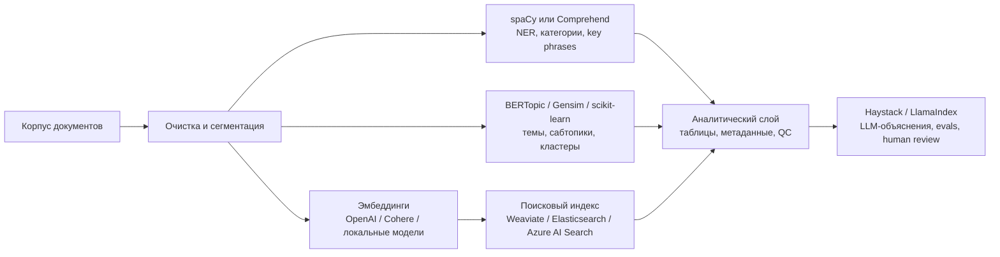
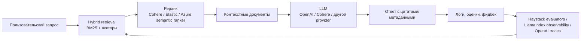

# Аналитический отчёт по библиотекаам и фреймворкам для автоматизированного анализа текстов с использованием LLM, эмбеддингов и классических алгоритмов

## Исполнительное резюме

Рынок инструментов для автоматизированного анализа текстов в 2026 году хорошо делится на четыре слоя. Для **исследовательского анализа корпусов** сильнее всего выглядят BERTopic, Gensim и scikit-learn: они дают топик-моделирование, кластеризацию и хороший контроль над качеством признаков и метрик. Для **извлечения сущностей и структурированных сигналов** наиболее зрелыми остаются spaCy и Amazon Comprehend. Для **гибридных LLM-пайплайнов** чаще всего выбирают Haystack и LlamaIndex. Для **интерактивного семантического поиска и RAG** ядром системы обычно становятся Weaviate, Elasticsearch или Azure AI Search, а Cohere и OpenAI часто выступают как поставщики эмбеддингов, реранка и LLM-слоя. citeturn12search3turn11search3turn8search4turn32search6turn13search1turn14search3turn2search4turn10search18turn28search12turn25search15turn4search1

Если нужен **лучший баланс “эмбеддинги + классика + интерпретируемость”**, BERTopic сегодня особенно силён: он объединяет эмбеддинги, кластеризацию и c-TF-IDF, поддерживает иерархические темы, online/incremental сценарии и LLM-based тонкую настройку представлений тем. Но это всё ещё инструмент прежде всего для batch/исследовательской аналитики, а не для on-line retrieval-сервиса. citeturn12search3turn12search0turn12search1turn12search2turn12search11turn12search16

Если нужен **поиск по смыслу в продакшене**, то практический выбор обычно сводится к трем семействам. **Azure AI Search** удобен как полностью управляемый enterprise-сервис с hybrid search, semantic ranker, integrated vectorization, chunking и skillsets. **Elasticsearch** силён там, где уже есть стек Elastic, нужен mature full-text + vector + rerank и near-real-time индексирование. **Weaviate** удобен как AI-native векторная БД с BM25+vector hybrid, подключаемыми vectorizers/rerankers/generative-модулями и хорошей DX для Python/TS/Go/Java/C#. citeturn28search12turn28search2turn28search4turn7search6turn23view0turn10search18turn10search2turn10search14turn2search4turn2search3turn2search13turn31search0

Если нужен **контроль качества, explainability и наблюдаемость**, то лучше всего смотрятся **Haystack** и **LlamaIndex**, но по-разному. Haystack даёт более “инженерный”, явный пайплайновый контроль, множество document stores и штатные evaluators для retrieval/RAG. LlamaIndex сильнее в быстром подключении данных, ingestion pipelines, metadata extraction, workflow/agent-паттернах и observability/evaluation, то есть удобнее для быстрого прототипирования и data-to-agent сценариев. citeturn13search2turn13search13turn13search15turn13search19turn14search0turn14search1turn14search2turn14search6turn14search14

В итоговом выборе полезно руководствоваться простым правилом. Для **исследовательского анализа больших корпусов** — BERTopic + Gensim/scikit-learn + spaCy. Для **интерактивного семантического поиска** — Azure AI Search / Elasticsearch / Weaviate, дополненные Cohere или OpenAI для embed/rerank/LLM. Для **объяснимых пайплайнов с QC** — Haystack или spaCy+scikit-learn, где классические шаги остаются детерминированными, а LLM используется поверх них. Для **быстрого прототипа LLM+классика** — LlamaIndex или Haystack, к которым подмешиваются BERTopic и spaCy как специализированные аналитические слои. citeturn12search3turn11search3turn8search8turn32search6turn13search1turn14search3turn28search12turn2search4turn10search18turn25search15turn4search0

## Критерии отбора и карта рынка

В отчёт включены не только “чистые” библиотеки топик-моделирования или NER, но и более широкие фреймворки и сервисы, которые специалисты реально используют как **ядро рабочей системы анализа текстов**: аналитические библиотеки, extraction/NLP-стек, orchestration-слой для LLM и retrieval-платформы. Такой срез лучше отражает практику продакшн-команд, где один инструмент почти никогда не закрывает весь цикл — от разметки и тематического анализа до интерактивного поиска и контроля качества. citeturn13search10turn14search8turn28search0turn30search0

Для open-source инструментов я смотрел на семь сигналов: наличие официальной документации, активные релизы, размер сообщества, понятную лицензию, ширину интеграций, наличие production-сценариев и поддержку хотя бы одной из ключевых задач пользователя — topic modeling, subtopics, clustering, entity extraction, semantic search. По этим признакам особенно зрело выглядят scikit-learn, spaCy, Haystack, LlamaIndex, Weaviate и Elasticsearch; BERTopic и Gensim более нишевые, но по своим задачам остаются признанными и востребованными. citeturn19view3turn19view4turn20view1turn20view2turn19view5turn24view0turn20view0turn18view0

Полезно различать четыре продуктовых ниши. **Аналитические библиотеки** дают темы, кластеры, признаковые пространства и эксперименты с качеством; сюда относятся BERTopic, Gensim и scikit-learn. **NLP/IE-инструменты** специализируются на извлечении сущностей и структурированных признаков; здесь лидируют spaCy и Amazon Comprehend. **LLM orchestration frameworks** координируют retrieval, routing, agents, evaluation, metadata extraction и observability; это прежде всего Haystack и LlamaIndex. **Retrieval/search-платформы** обеспечивают векторный индекс, гибридный поиск и реранк; сюда относятся Weaviate, Elasticsearch, Azure AI Search, а на уровне model services — Cohere и OpenAI. citeturn12search3turn11search3turn8search5turn32search6turn26search6turn9view1turn14search3turn21search13turn10search18turn28search0turn25search15turn4search0

Практически важное замечание для русскоязычных или мультиязычных корпусов: у ряда инструментов мультиязычность является штатной возможностью, а не обходным сценарием. BERTopic по умолчанию предлагает multilingual-режим, spaCy поддерживает десятки языков и многозадачные пайплайны, Cohere предлагает multilingual embed/rerank, OpenAI явно позиционирует `text-embedding-3-large` как сильную модель и для non-English задач, а Azure AI Search и Weaviate позволяют подключать выбранные embedding/vectorizer-провайдеры и строить multilingual hybrid search. citeturn12search5turn32search6turn25search1turn5search5turn27search12turn28search1turn2search7

## Каталог инструментов open-source и open-core

| Инструмент | Краткое описание | Ключевые возможности | Поддержка LLM / эмбеддингов / классики | Архитектура интеграции | Стек, лицензия, зрелость и сообщество | Примеры использования и ограничения |
|---|---|---|---|---|---|---|
| **BERTopic** citeturn12search3turn20view0 | Библиотека для topic modeling на базе BERT-эмбеддингов и c-TF-IDF. | Иерархические темы, subtopics, online/incremental режим, визуализации, настройка representations, динамические и class-based темы. citeturn12search0turn12search1turn12search14turn12search19 | **LLM:** да, для генерации/уточнения topic labels и representations. **Эмбеддинги:** да, встроенно/через backends. **Классика:** да, c-TF-IDF, замена HDBSCAN на k-means и других кластеризаторов. citeturn12search2turn12search8turn12search11turn12search20 | Обычно встраивается как batch-слой после очистки и сегментации текста; upstream можно подавать любые embeddings, downstream — экспортировать темы, topic-document assignments и иерархии в BI, search index или LLM-пайплайн. citeturn12search9turn12search12turn12search18 | Python; лицензия MIT. Репозиторий показывает около **7.7k stars**, **37 releases**, последний релиз — **3 декабря 2025**. citeturn20view0 | Подходит для исследовательского анализа больших неразмеченных корпусов, анализа сабтопиков и тематической эволюции. Ограничения: не является полнофункциональным real-time search engine; качество сильно зависит от embedding model, reduction/clustering и параметров stopwords/representation. citeturn12search0turn12search1turn12search11turn12search16 |
| **Gensim** citeturn18view0turn11search3 | Классическая библиотека для topic modelling, similarity retrieval и semantic vectors на больших корпусах. | LDA, LSI/LSA, HDP, similarity queries, word2vec/fastText, streaming/out-of-core обработка, distributed/cluster execution. citeturn18view0turn11search1turn11search2turn11search9turn11search18 | **LLM:** нет нативно. **Эмбеддинги:** word2vec/fastText и связанные similarity-метрики. **Классика:** да, это основной сценарий. citeturn11search17turn11search18turn18view0 | Хорош как “классический аналитический движок” в batch-контурах; часто комбинируется со spaCy/scikit-learn для препроцессинга и с векторными БД/поиском для downstream retrieval. citeturn11search2turn11search7 | Python; лицензия LGPL-2.1. Репозиторий показывает около **16.4k stars**; проект находится в **stable maintenance mode**; последний релиз — **16 октября 2025**. citeturn18view0 | Силен для больших корпусов больше RAM, классического topic modeling и similarity analysis. Ограничения: нет native LLM orchestration; экосистема развивается консервативно, без акцента на новые LLM-patterns. citeturn18view0turn11search16 |
| **scikit-learn** citeturn19view3turn8search4 | Стандартная библиотека классического ML в Python; в тексте — базовый слой для TF-IDF, классификации, кластеризации и topic extraction. | Text vectorization, Pipelines, grid search, clustering, LDA/NMF topic extraction, MiniBatchKMeans для масштабирования. citeturn8search5turn8search8turn8search12turn8search16turn8search20 | **LLM:** нет нативно. **Эмбеддинги:** только при внешнем расчёте. **Классика:** максимально сильна. citeturn8search4turn8search5turn8search16 | Обычно является детерминированным шагом в ETL/RAG/QC-контурах: векторизация → модель → оценка → сохранение артефактов. Хорошо сочетается со spaCy, BERTopic, Haystack и LlamaIndex как explainable/classical слой. citeturn8search8turn8search20 | Python; BSD-3-Clause. Репозиторий показывает около **66.4k stars**; проект ведётся с 2007 года; активные релизы продолжаются, например релиз в декабре 2025. citeturn19view3turn8search22 | Лучший выбор для пайплайнов, где важны контроль признаков, воспроизводимость и понятные метрики. Ограничения: нет нативного semantic retrieval, vector stores и LLM-функций — всё это нужно доклеивать отдельно. citeturn8search4turn8search5turn8search8 |
| **spaCy** citeturn32search6turn19view4 | Production-oriented NLP-библиотека для information extraction и structured NLP pipelines. | NER, POS, parsing, sentence segmentation, text classification, lemmatization, entity linking, transformers; `spacy-llm` добавляет LLM-компоненты в пайплайн. citeturn32search0turn32search1turn32search2turn32search6 | **LLM:** да, через `spacy-llm`. **Эмбеддинги:** pretrained vectors и transformers. **Классика:** да, rule-based + trainable components. citeturn32search0turn32search6turn32search23 | Обычно используется как слой извлечения сущностей, категорий и линкования перед topic modeling, indexing или analytics. Очень удобен, когда LLM нужно “завернуть” в структурированный output внутри строгого NLP-пайплайна. citeturn32search0turn32search3turn32search8 | Python; MIT. Репозиторий показывает около **33.7k stars**, **136 releases**; последний релиз — **29 марта 2026**. На сайте заявлены **75+ языков** и **84 trained pipelines для 25 языков**. citeturn19view4turn32search6 | Отличен для NER, entity linking, text classification и explainable IE-пайплайнов. Ограничения: topic modeling и semantic search не являются его core use case, поэтому его почти всегда комбинируют с другими инструментами. citeturn32search1turn32search2turn32search6 |
| **Haystack** citeturn9view1turn20view1 | Open-source AI orchestration framework для RAG, agents, semantic search и модульных retrieval-пайплайнов. | Retrievers, rankers, LLM extractors, routers, evaluation, интеграции с document stores и model providers, прозрачные pipeline/agent workflows. citeturn13search0turn13search1turn13search2turn13search12turn13search13turn13search19 | **LLM:** да, сильно. **Эмбеддинги:** да, через интеграции/model providers/document stores. **Классика:** да, BM25, фильтры, детерминированные шаги, hybrid retrieval. citeturn13search1turn13search2turn13search24 | Архитектурно это “клей” между model providers, retrieval-инфраструктурой и evaluators. Хорош для production pipelines с явным routing, quality checks и контролем контекста до вызова LLM. citeturn9view1turn13search14turn13search15turn13search23 | Python; Apache-2.0. Репозиторий показывает около **25.6k stars** и последний релиз **18 июня 2026**. citeturn20view1 | Идеален для explainable RAG, гибридного retrieval и evaluation-driven разработки. Ограничения: topic modeling и corpus exploration не являются его сильной стороной; их лучше приносить извне. citeturn13search13turn13search19turn13search21 |
| **LlamaIndex** citeturn14search3turn20view2 | Фреймворк для построения LLM-powered agents и workflows поверх собственных данных. | Ingestion pipeline, metadata extraction, vector indexes, workflows/agents, observability, evaluation, множество интеграций. citeturn14search0turn14search1turn14search2turn14search6turn14search14 | **LLM:** да, core feature. **Эмбеддинги:** да, как часть ingestion/indexing. **Классика:** ограниченно; основной фокус — retrieval and agentic workflows, а не classical text mining. citeturn14search0turn14search4turn14search12 | Обычно используется по схеме loaders/parsers → chunking → metadata extraction → embeddings → vector store/query engine → agent/workflow → evals/observability. Репозиторий указывает **300+ integration packages**. citeturn9view2turn14search9 | Python и TypeScript; MIT. Репозиторий показывает около **50.2k stars**, **494 releases**; последний релиз — **14 мая 2026**. citeturn20view2turn14search11 | Значительно ускоряет прототипирование LLM+retrieval систем. Ограничения: topic modeling, статистическая кластеризация и NER-контроль обычно реализуются не в нём самом, а через внешние библиотеки. citeturn14search1turn14search6 |
| **Weaviate** citeturn21search13turn19view5 | AI-native open-source vector database для semantic/hybrid search и RAG. | Vector search, BM25+vector hybrid, reranking, generative modules, automatic vectorization, explainable hybrid scores, масштабирование до large/billion-scale workloads. citeturn2search4turn2search13turn2search17turn2search18turn2search22turn2search15 | **LLM:** да, через generative modules/RAG. **Эмбеддинги:** да, auto-vectorization/integrations. **Классика:** частично, через BM25/hybrid. citeturn2search1turn2search3turn2search7turn2search14 | Типовая интеграция: ingestion → vectorizer/external embeddings → collection/index → hybrid retrieval → rerank → RAG/agent. Есть официальные клиенты для Python, TS/JS, Go, Java и C#. citeturn31search0turn31search10 | Core — open-source, BSD-3-Clause; cloud — managed. Репозиторий показывает около **16.4k stars**, **548 releases**; последний релиз — **18 июня 2026**. Weaviate Cloud имеет free tier; Flex начинается от **$45/мес**. citeturn19view5turn21search0turn21search8 | Хорош для интерактивного semantic search и как backend для RAG. Ограничения: не делает topic modeling и extraction “из коробки”; для аналитики тем/сущностей нужен соседний стек. citeturn2search4turn2search18 |
| **Elasticsearch** | Распределённый search/analytics engine и vector database на Lucene, сильный в full-text + vector + near-real-time use cases. citeturn23view0turn30search11 | Semantic search, hybrid retrieval, ELSER sparse retrieval, semantic reranking, near-real-time indexing, широкий набор официальных клиентов. citeturn10search18turn10search14turn10search2turn30search2 | **LLM:** да, через generative/RAG use cases и inference integrations. **Эмбеддинги:** да. **Классика:** да, полный full-text/lexical стек. citeturn23view0turn10search18 | Интегрируется как центральный retrieval/store слой: индекс документов → lexical/vector/hybrid retrieval → rerank → downstream application/LLM. Есть официальные клиенты для Go, Java, JavaScript, .NET, PHP, Python, Ruby, Rust. citeturn30search0turn30search2turn30search6turn30search8 | Лицензирование смешанное: Elastic добавил AGPLv3 как опцию для исходников наряду с SSPL и Elastic License, но релизы продолжают выходить под Elastic License; self-managed Basic — free/open, коммерческие подписки — через sales. Репозиторий показывает около **77.1k stars**; последний релиз — **28 мая 2026**. citeturn10search1turn10search16turn24view0 | Очень хорош для enterprise search и real-time/hybrid retrieval. Ограничения: топики, сабтопики и IE надо строить внешними шагами или ML-pipelines вне core search engine. citeturn10search18turn10search2 |

В open-source слое видно два устойчивых паттерна. Первый — **“аналитика корпусов”**, где BERTopic, Gensim и scikit-learn дают сильнее всего именно темы, признаки и кластеры. Второй — **“production retrieval and orchestration”**, где Haystack, LlamaIndex, Weaviate и Elasticsearch закрывают retrieval, pipeline control, observability и hybrid search, но почти всегда требуют отдельного аналитического слоя для темы/сабтопиков и отдельного extraction-слоя для сущностей. citeturn12search0turn11search1turn8search5turn13search13turn14search2turn2search4turn10search18

## Каталог коммерческих инструментов и платформ

| Инструмент | Краткое описание | Ключевые возможности | Поддержка LLM / эмбеддингов / классики | Архитектура интеграции | Стек, лицензия/цена, зрелость | Примеры использования и ограничения |
|---|---|---|---|---|---|---|
| **Azure AI Search** | Управляемый enterprise-search сервис Microsoft для text, vector и multimodal retrieval. citeturn28search0turn28search7 | Hybrid search с RRF, semantic ranker, integrated vectorization, automatic chunking, skillsets, entity recognition, key phrase extraction, indexers, knowledge sources/knowledge bases. citeturn28search12turn28search2turn28search17turn7search6turn7search14 | **LLM:** да, через agentic retrieval / AI enrichment / model integrations. **Эмбеддинги:** да, встроенная vectorization или external embeddings. **Классика:** да, full-text, filters, skillsets. citeturn28search1turn28search4turn7search2 | Архитектура обычно такая: data source → indexer + skillset → chunking/vectorization → search index → hybrid query + semantic ranker → app/agent. Доступ через portal, REST API и SDK для .NET, Java, JavaScript, Python. citeturn28search7turn28search10turn28search3 | Коммерческий сервис. Публично доступны capacity-based и usage-based tiers; vector search доступен на всех tiers без отдельной наценки, semantic ranker тарифицируется как premium usage feature. citeturn3search0turn3search4turn3search8 | Очень силён для управляемого hybrid/semantic search на enterprise-данных. Ограничения: экосистема Azure-native; topic modeling как отдельного первичного сценария тут нет. citeturn28search12turn28search4 |
| **OpenAI API** | Платформа моделей и инструментов, полезная как слой эмбеддингов, built-in file search, agents, evaluators и orchestration. citeturn27search11turn4search2 | Text embeddings для search/clustering/classification, file search по vector stores с semantic + keyword search, Responses API, Agents SDK, traces/evals/observability. citeturn4search0turn4search1turn27search1turn27search3turn27search5turn27search16 | **LLM:** да, core. **Эмбеддинги:** да. **Классика:** нет как нативного блока, но embeddings можно использовать в классических пайплайнах на стороне клиента. citeturn27search7turn27search12 | Типовая интеграция: данные → vector store/file search или собственная БД → retrieval/tool use → model → traces/evals. Есть SDK/quickstarts для JavaScript, Python, .NET, Java, Go; Agents SDK ориентирован прежде всего на TypeScript и Python. citeturn27search0turn27search3turn27search6 | Коммерческий API. Pricing — token-based по моделям; file search стоит **$0.10/GB-day** хранения и **$2.50/1k tool calls**. citeturn15view0 | Отличен как универсальный LLM/embed слой и быстрый путь к file-grounded assistants. Ограничения: не является законченной системой text mining; topic modeling, NER и explainable classical analytics нужно формировать внешними шагами. citeturn4search0turn4search1turn27search16 |
| **Cohere** | Коммерческая платформа enterprise LLMs и retrieval-моделей с сильным акцентом на Embed и Rerank. citeturn5search11turn25search7 | Embed, Rerank, Classify, tool use, multilingual search, Embed Jobs для больших корпусов, private deployments и dedicated model hosting. citeturn5search0turn5search1turn5search2turn5search3turn25search2 | **LLM:** да. **Эмбеддинги:** да, в том числе режимы под search/classification/clustering. **Классика:** частично — в основном как downstream использование embeddings/classify, не как полный statistical toolkit. citeturn5search2turn5search6turn25search9 | Хорошо встраивается как model layer над существующим search stack или vector DB. SDK поддерживаются в Python, TypeScript, Java и Go; есть Compatibility API для использования через OpenAI SDK. citeturn25search0turn25search3turn25search11 | Trial API keys бесплатны, но rate-limited; production keys — pay-as-you-go. Для private hosting есть Model Vault, где, например, Embed 4 Small указан от **$4/час** или **$2,500/мес** за instance. citeturn29view0 | Силен для multilingual semantic search и reranking. Ограничения: сам по себе не заменяет search index/vector DB; topic modeling есть в recipes/cookbooks, а не как first-class product feature. citeturn25search15turn5search14 |
| **Amazon Comprehend** | Управляемый AWS NLP-сервис с pre-trained и custom моделями для IE/classification/topic analysis. citeturn26search6turn3search19 | Named entities, key phrases, sentiment, language detection, custom classification, custom entity recognition, synchronous и asynchronous document processing, topic modeling на LDA. citeturn26search15turn26search16turn6search2turn6search0turn26search2 | **LLM:** нет как core feature. **Эмбеддинги:** нет как штатный retrieval-слой. **Классика:** да, topic modeling и извлечение признаков — core use case. citeturn6search0turn26search21 | Интегрируется через AWS SDKs, CLI, console и асинхронные jobs по S3. Есть real-time и batch/mass processing режимы. citeturn26search0turn26search4turn26search21turn26search5 | Цены зависят от API и объёма; есть free tier **50K units of text per month** для ряда API, topic modeling тарифицируется отдельно по job volume. Важное ограничение: topic modeling больше **не доступен новым клиентам**. citeturn3search3turn6search8 | Полезен для управляемого IE и классического NLP в AWS-среде. Ограничения: не закрывает LLM+retrieval стек и не является современным vector/semantic search engine. citeturn26search6turn26search21 |

Коммерческий слой отличается от open-source не столько “лучшей математикой”, сколько **управляемостью, биллингом, SLA и глубиной облачной интеграции**. Azure AI Search и Amazon Comprehend — это прежде всего managed services, где важны indexers, skillsets, quotas и cloud-native operations. OpenAI и Cohere — скорее model/platform providers, которые удобно подключать к своей retrieval-инфраструктуре или к open-source фреймворкам вроде Haystack и LlamaIndex. citeturn28search7turn26search21turn27search0turn25search0turn13search10turn14search8

## Сравнение инструментов и архитектурные паттерны

Ниже — компактное сравнение инструментов по тем атрибутам, которые обычно определяют архитектурный выбор: есть ли у продукта native topic modeling, умеет ли он clustering или только retrieval, насколько хорошо работает гибрид **LLM + классика**, какой режим он любит — real-time или batch, и насколько сложно его встроить в существующий стек. Оценки “высокая/средняя/низкая” — это синтез официальной документации и product positioning, а не внешний benchmark. citeturn12search3turn11search3turn32search6turn9view1turn14search3turn21search13turn23view0turn28search0turn25search15turn4search0turn26search6

| Инструмент | Топик-моделирование | Кластеризация | Гибрид LLM+классика | Масштабируемость | Realtime / Batch | Требования к данным | Простота интеграции |
|---|---|---:|---:|---|---|---|---:|
| **BERTopic** citeturn12search3turn12search0turn12search1 | **Да, сильная** | **Да** | **Высокая** | Средняя до высокой | Batch, incremental | Неразмеченный корпус; хорошие embeddings желательны | Средняя |
| **Gensim** citeturn18view0turn11search1turn11search9 | **Да, сильная** | Частично | Низкая | Высокая на streaming corpora | Batch | Неразмеченный корпус, токенизация/словарь | Средняя |
| **scikit-learn** citeturn8search5turn8search12turn8search8 | **Да** | **Да, сильная** | Средняя | Высокая | Batch, limited online via partial fit components | Чистые признаки/векторы; часто нужен препроцессинг | Высокая |
| **spaCy** citeturn32search6turn32search0turn32search1 | Нет | Нет как core | **Высокая** | Высокая | Realtime и batch | Тексты; для supervised tasks желательны размеченные данные | Высокая |
| **Haystack** citeturn13search1turn13search13turn13search19 | Нет нативно | Через внешние шаги | **Очень высокая** | Высокая | Оба | Индексируемые документы + store/model provider | Средняя |
| **LlamaIndex** citeturn14search0turn14search1turn14search2 | Нет нативно | Через embeddings/external libs | **Очень высокая** | Высокая | Оба | Документы, chunking, metadata, vector store | **Высокая** |
| **Weaviate** citeturn2search4turn2search13turn31search0 | Нет | Нет как analytical feature | **Высокая** | **Очень высокая** | В основном realtime, batch ingestion | Chunked docs + vectors/auto-vectorization | Средняя |
| **Elasticsearch** citeturn10search18turn10search2turn30search2 | Нет | Нет как analytical feature | **Высокая** | **Очень высокая** | **Сильно realtime** | Индекс + текстовые и/или векторные поля | Средняя |
| **Azure AI Search** citeturn28search12turn28search2turn7search6 | Нет | Нет как analytical feature | **Высокая** | **Очень высокая** | Оба | Data source, indexer/skillset или внешние vectors | **Высокая** |
| **OpenAI API** citeturn4search0turn27search1turn27search3 | Нет | Через embeddings на стороне клиента | **Очень высокая** | Высокая | Оба | Файлы/vector store или собственный retrieval backend | **Высокая** |
| **Cohere** citeturn5search2turn5search1turn25search2 | Через recipes | Через embeddings | **Очень высокая** | Высокая | Batch + realtime query/update | Корпус, chunks, candidate docs for rerank | **Высокая** |
| **Amazon Comprehend** citeturn6search0turn26search21turn26search2 | **Да**, но с оговоркой для новых клиентов | Нет как general clustering | Низкая | Высокая | Оба | Документы в API/S3; для custom — размеченные данные | Высокая |

Из этой таблицы видно, что **одного универсального лидера нет**. Если задача — найти темы и сабтопики, retrieval-платформы не заменят BERTopic/Gensim/scikit-learn. Если задача — быстрый low-latency semantic search, наоборот, аналитические библиотеки не заменят Weaviate/Elastic/Azure. А если нужен контроль качества и orchestration поверх retrieval, то центр тяжести смещается к Haystack, LlamaIndex и частично к OpenAI Agents SDK. citeturn12search0turn11search1turn8search12turn2search4turn10search18turn28search12turn13search13turn14search2turn27search5

Ниже — две типовые архитектуры, которые на практике дают лучший результат, чем попытка “назначить один инструмент на всё”. Первая — для batch/исследовательского анализа корпусов с explainability и последующей генерацией инсайтов. Вторая — для интерактивного hybrid search с реранком и LLM-ответом. Эти схемы синтезируют рекомендуемые интеграционные паттерны из документации BERTopic, spaCy, Haystack, LlamaIndex, Weaviate, Elasticsearch, Azure AI Search, Cohere и OpenAI. citeturn12search9turn32search0turn13search10turn14search12turn2search3turn10search2turn28search10turn25search15turn4search0

## Рекомендации по сценариям использования

Для задачи **исследовательского анализа больших корпусов** лучшая базовая связка — **BERTopic + scikit-learn + spaCy**, а если корпус действительно огромный и не помещается в память, то стоит добавить **Gensim** как streaming/out-of-core слой. BERTopic даст современные темы и сабтопики на эмбеддингах, scikit-learn — контролируемые baseline-модели, NMF/LDA и кластеры, spaCy — сущности, категории и entity linking для обогащения тем, а Gensim — надёжную обработку очень больших корпусов и классические тематические модели. Это особенно хороший вариант для аналитиков, которым нужны объяснимость, управляемые признаки и повторяемые исследования, а не мгновенный интерактивный сервис. citeturn12search0turn12search1turn8search5turn8search12turn32search6turn32search2turn18view0turn11search1

Для **интерактивного семантического поиска** лучше выбирать не “аналитическую библиотеку”, а **search-native платформу**. Если нужен максимально управляемый корпоративный сервис — **Azure AI Search**. Если команда уже живёт в стеке Elastic или нужна очень сильная full-text история рядом с vector/hybrid — **Elasticsearch**. Если приоритетом являются AI-native DX, гибкие model integrations и быстрый старт на open-source / cloud — **Weaviate**. В любом из этих трёх вариантов дополнительные выигрыши обычно дают **Cohere Rerank** или LLM/rerank-слой аналогичного класса, а OpenAI/Cohere embeddings удобно использовать как upstream источник векторных представлений. citeturn28search12turn28search4turn23view0turn10search18turn10search2turn2search4turn2search13turn25search1turn5search1turn4search1

Для **пайплайнов с explainability и контролем качества** я бы ставил в центр не “самый модный LLM-фреймворк”, а **Haystack** или связку **spaCy + scikit-learn + retrieval-store**. Причина проста: deterministic steps, metadata routing, retrieval metrics, faithfulness/context relevance и внешние eval frameworks проще держать под контролем там, где pipeline явно моделируется как последовательность компонентов. Haystack здесь особенно силён: есть evaluators для retrieval и RAG, rankers, routers, metadata filtering и интеграции с разными document stores. Если нужен ещё более строгий контроль над извлечением сущностей, правилами и постобработкой, spaCy как extraction-слой часто даёт более предсказуемое поведение, чем “сразу всё отдать LLM”. citeturn13search13turn13search15turn13search19turn13search23turn13search4turn13search12turn32search0turn32search2turn8search8

Для **быстрого прототипирования с LLM + классикой** лучшая развилка такая. Если нужна максимальная скорость сборки, готовые integrations, ingestion и data-to-agent паттерны, выбирайте **LlamaIndex**. Если важнее явная схема пайплайна, сравнение retrievers/rankers и производственная прозрачность — **Haystack**. В обоих случаях не стоит пытаться реализовать topic modeling и NER “посредством промпта”, если эти задачи для вас существенны: намного надёжнее подключить **BERTopic** для тем/сабтопиков и **spaCy** для сущностей/категорий как отдельные специализированные шаги. Тогда LLM остаётся надстроечным слоем — для label refinement, summaries, narrative generation, explanation и agentic workflows — а не единственным механизмом анализа. citeturn14search3turn14search0turn14search2turn9view1turn13search10turn12search2turn12search14turn32search0turn32search6

Если выбирать **минимально достаточные стартовые стеки**, то они выглядят так. Для академического/аналитического исследования корпуса: **BERTopic + spaCy + scikit-learn**. Для корпоративного semantic search: **Azure AI Search** либо **Elasticsearch**, а в open-source-first сценарии — **Weaviate**. Для explainable RAG/QA: **Haystack + Elasticsearch/Weaviate/Azure AI Search**. Для быстрого demo/prototype: **LlamaIndex + OpenAI** или **LlamaIndex + Cohere**, причём сразу имеет смысл предусмотреть отдельный слой оценок и наблюдаемости, чтобы прототип не превратился в непрозрачную “чёрную коробку”. citeturn12search3turn32search6turn8search8turn28search12turn23view0turn21search13turn13search19turn14search2turn27search5turn25search15

По состоянию на **20 июня 2026 года** самый практичный вывод такой:  
**темы и сабтопики** — BERTopic;  
**классическая объяснимая аналитика** — scikit-learn и Gensim;  
**извлечение сущностей и структурированного смысла** — spaCy;  
**production orchestration и QC** — Haystack;  
**самое быстрое прототипирование data-to-agent** — LlamaIndex;  
**search backend** — Azure AI Search / Elasticsearch / Weaviate в зависимости от облака и стека;  
**модельный слой embed/rerank/LLM** — OpenAI или Cohere. citeturn12search3turn8search5turn11search1turn32search6turn13search13turn14search3turn28search12turn10search18turn2search4turn4search1turn5search1